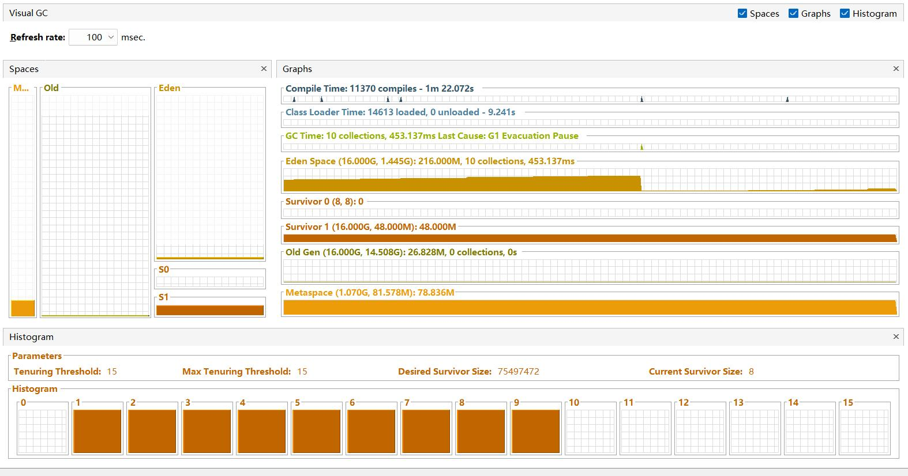

### 项目目的
VisualVM是一个好工具,可以用于查看JVM的运行状态,开发过程中经常用到。

VisualVM需要使用jstatd来连接远程的JVM,jstatd提供了一个`-p`的参数,可以指定一个端口,但实际上除了这个端口以外，jstatd还会随机开启一个端口,这个端口是不固定的,这样就导致了VisualVM无法连接到容器内的JVM。

本项目的目的就是解决这个问题,使用`javaagent`的方式来启动jstatd,在启动过程中修改jstatd的源码,使其不再随机开启端口,而是使用指定的端口。
### 使用方法
1. 将`jstatd-agent.jar`放到容器内
2. 启动jsatd,假设使用的端口是1099和1100,一个通过`-p`参数指定,一个通过`remoteHostPort`指定
```shell
jstatd -J-Djava.security.policy=jstatd.all.policy -J-javaagent:jstatd-agent.jar=remoteHostPort=1100 -J-Djava.rmi.server.hostname=0.0.0.0 -p 1099
```
3. 使用VisualVM连接到jstatd
4. 

### 注意
1. `remoteHostPort`是必填参数
2. `jstatd.all.policy`文件是jstatd的安全策略文件,需要加上
3. `remoteHostPort`指定得端口在映射的时候需要保证src和dest端口一致,但是`-p`指定的端口不需要一致.
如上述脚本中的`-p 1099`和`remoteHostPort=1100`,在映射的时候需要保证`1100:1100`,但是`1099`不需要

### 参考
https://github.com/anthony-o/ejstatd